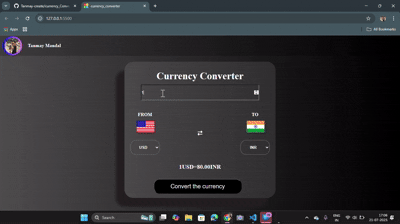

## Responsive Currency Converter Project(Real time conversion)

    

   
    
This project showcases runtime dynamic behavior with user-interactive interface. This incorporates real time 
conversions of currencies across different countries. Up to date, and accurate exchange rates.        

## Features:   

- Fetching API with base URL, end points, API key
- Asynchronous programming with async function, and promise chain
- Animations for instance, glowing effect after clicking button
- RunTime Dynamic, and user-interactive
- modular programming
- Responsive application 

## Tecnologies: 

HTML, CSS, JavaScript, AJAX(Asynchronous JavaScript and XML)

## Set-Up

git clone

    git clone https://github.com/Tanmay-create/currency_Converter.git
